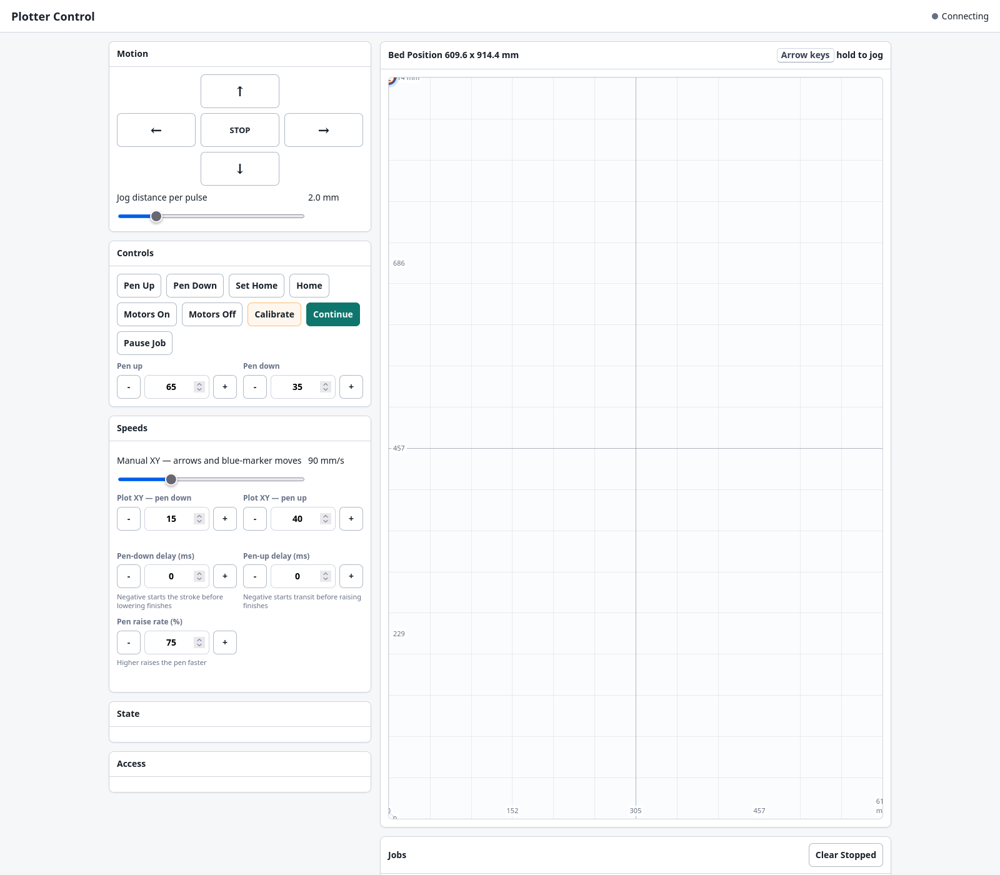

# ArtStation Plotter Server

A local server and browser-based control panel for operating a UUNA TEK ArtStation or compatible pen plotter.

## Features

- Send SVG plot jobs to the ArtStation from any authenticated device on your local network.
- Manage the queue and job history from the web interface, including pausing, resuming, rerunning, and cancelling jobs.
- View the plot head on a bed map, move it to precise coordinates, and set or return to a custom home position from the browser.
- Tune manual travel speed, pen-up and pen-down plotting speeds, servo positions, pen timing, and pen-raise rate.
- Submit ordered, multi-layer jobs. The server pauses before the first layer and between layers so the operator can fit or change pens.
- Persist queued jobs, job history, plot settings, pen settings, and position estimates across server restarts.
- Validate SVG dimensions and reject movements outside the configured plotter bed.
- Calibrate one removable ink well and prepare dip-pen or brush jobs with automatic, between-stroke ink-loading trips.
- Monitor and control the plotter through either the web interface or the included terminal tools.

This is an early release for operators who are comfortable configuring and supervising physical plotter hardware. Keep a hand near the power switch and verify the configured bed dimensions before moving the carriage.

## Web interface



## Requirements

- Linux with Python 3.12 or newer
- An AxiDraw-compatible controller accessible through a serial device
- Membership in the `dialout` group, or an equivalent way to access the serial device

## Installation

```bash
git clone <repository-url> ~/plotter
cd ~/plotter
python3 -m venv venv
venv/bin/pip install -r requirements.txt
cp .env.example .env
chmod 600 .env
```

Edit `.env`, set a strong `PLOTTER_TOKEN`, and confirm the serial port and bed dimensions. Then start the service:

```bash
scripts/start_plotter_server.sh
```

Open `http://127.0.0.1:8765/control` on the plotter computer. The service currently binds to all interfaces so authenticated upload clients can reach it; use only on a trusted network unless you put it behind HTTPS and an appropriately configured proxy.

## Operation

The browser panel provides positioning and job controls. The local CLI provides status and emergency operational commands:

```bash
scripts/plotctl state
scripts/plotctl jobs
scripts/plotctl watch
scripts/plotconsole
```

Upload one or more SVG layers in plotting order:

```bash
curl -H "X-Plotter-Token: $PLOTTER_TOKEN" \
  -F "files=@layer-1.svg" \
  -F "files=@layer-2.svg" \
  -F "layer_names=Blue,Black" \
  http://127.0.0.1:8765/plot/layers
```

The worker waits for local operator confirmation before the first layer and between layers. Uploaded SVG dimensions must fit within `MAX_PLOTTER_WIDTH_MM` and `MAX_PLOTTER_HEIGHT_MM`.

Several setup panels have ON/OFF switches. OFF keeps the saved values but stops that module affecting new work: Paper OFF ignores saved paper size/top-right for previews and job alignment, and Ink Well OFF ignores the saved keep-out zone. Plot Bed Calibration OFF also keeps the saved calibration, but the browser asks for confirmation because absolute moves, Home, paper, and ink-well setup may be unsafe when calibration is not trusted.

The **Clear stopped jobs** button removes completed, failed, cancelled, interrupted, paused, and dip-failed jobs from the server view permanently. By default it preserves job artifacts and logs on disk but deletes each cleared job's `job.json` metadata record, so cleared jobs do not reappear after a refresh or service restart.

For dip pens and brushes, use the **Ink Well** panel to save the centre, keep-out radius, clearance servo position, dip depth, dwell times, and optional pickup circles. Pickup circles are small pen-down circles run inside the well after dipping; the default is 3 circles at 10 mm diameter, run at 60 mm/s. A successful test cycle is required before the ink-well check can be enabled. While the check is enabled, every upload and rerun is checked against the keep-out circle, including pen-up travel. Disable the ink-well check when the well is not physically installed or not needed; the saved setup is retained, but upload/rerun keep-out validation ignores it.

Enable **Automatic ink dipping** in the **Ink Well** panel and set the interval there. That value is saved as the default for future jobs, including jobs uploaded from external clients that do not explicitly send an `auto_dip` value. If a job is already paused with auto dipping enabled, saving updates that job's interval too; if a job is waiting at the start prompt, the current field value is used when you press **Start**. The server prepares an AxiDraw plot digest, schedules dips only between complete strokes, and reports the estimated dip count and longest uninterrupted stroke. Each enabled layer dips once before drawing. Existing AxiDraw programmatic-pause layers are rejected for automatic-dip jobs.

Automatic dipping can also be requested through the upload API:

```bash
curl -H "X-Plotter-Token: $PLOTTER_TOKEN" \
  -F "files=@drawing.svg" \
  -F "auto_dip=true" \
  -F "dip_interval_s=60" \
  http://127.0.0.1:8765/plot/layers
```

Any dip servo, travel, or return-position error leaves the job in `dip_failed`. The operator must explicitly choose **Retry Dip**, **Skip Dip & Resume**, or cancel the job. See [`docs/ink-dip-hardware-check.md`](docs/ink-dip-hardware-check.md) before the first live test.

Calibration establishes the bed coordinate system at the top-left point and initially sets that point as Home. Move the head to any calibrated bed position and use **Set Home** to replace it. **Home** and automatic post-layer returns then go to that saved point without changing the bed coordinates.

## Plotter control architecture

The project uses `axicli` for full SVG plotting and a narrow direct EBB serial control layer for latency-sensitive operator actions. Direct serial is used for short actions such as jogging, pen up/down, browser Home return, and ink-well dip cycles. Full layer plotting remains on `axicli` so SVG parsing, path planning, acceleration behavior, and AxiDraw compatibility stay with the upstream driver.

See [`docs/axicli-vs-direct-ebb.md`](docs/axicli-vs-direct-ebb.md) for the boundary, tradeoffs, and runtime-state policy.

## Testing

The automated suite does not access hardware:

```bash
PLOTTER_DISABLE_WORKER=1 venv/bin/python -m unittest discover -v
```

[`manual_tests/hardware_smoke.py`](manual_tests/hardware_smoke.py) is deliberately outside automated test discovery. It moves real hardware and must only be run explicitly.

## Service installation

The included start script assumes the repository is at `~/plotter`. A user-level systemd service can use:

```ini
[Service]
WorkingDirectory=%h/plotter/server
EnvironmentFile=%h/plotter/.env
ExecStart=%h/plotter/scripts/start_plotter_server.sh
Restart=on-failure
```

Run a single Uvicorn worker. Job state and hardware access are process-local and are not designed for multiple server workers.

## Contributing

Issues and pull requests are welcome. Changes to movement, homing, cancellation, or serial commands should include non-hardware tests and a clear manual verification procedure.

## License

Copyright (C) 2026 ArtStation Plotter Server contributors.

This project is free software licensed under the GNU General Public License, version 3. See [`LICENSE`](LICENSE).
